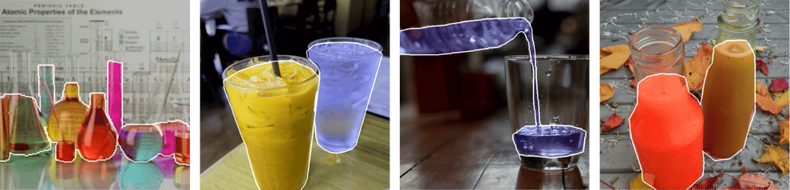
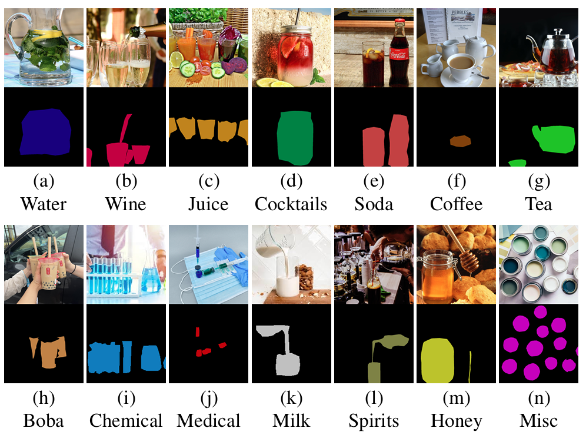

# Learning to Segment Liquids in Real-world Images

Different types of liquids such as water, wine and medicine appear in all aspects of daily life. However, limited attention has been given to the task, hindering the ability of robots to avoid or interact with liquids safely. The segmentation of liquids is difficult because liquids come in diverse appearances and shapes; moreover, they can be both transparent or reflective, taking on arbitrary objects and scenes from the background or surroundings. To take on this challenge, we construct a large-scale dataset of liquids named LQDS consisting of 5000 real-world images annotated into 14 distinct classes, and design a novel liquid detection model named LQDM, which leverages cross-attention between a dedicated boundary branch and the main segmentation branch to enhance segmentation predictions. Extensive experiments demonstrate the effectiveness of LQDM on the test set of LQDS, outperforming state-of-the-art methods and establishing a strong baseline for the semantic segmentation of liquids.

---

[[code](https://github.com/lonaslee/LQDM)]

[[dataset](https://drive.google.com/drive/folders/1KIouI3V6XdIfXIgko9MYjBQfar183Wej?usp=sharing)]
